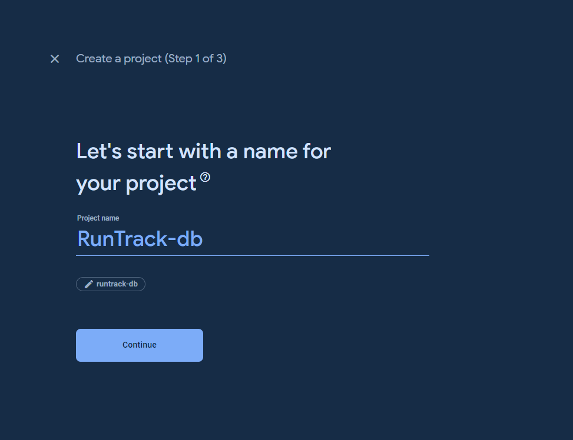
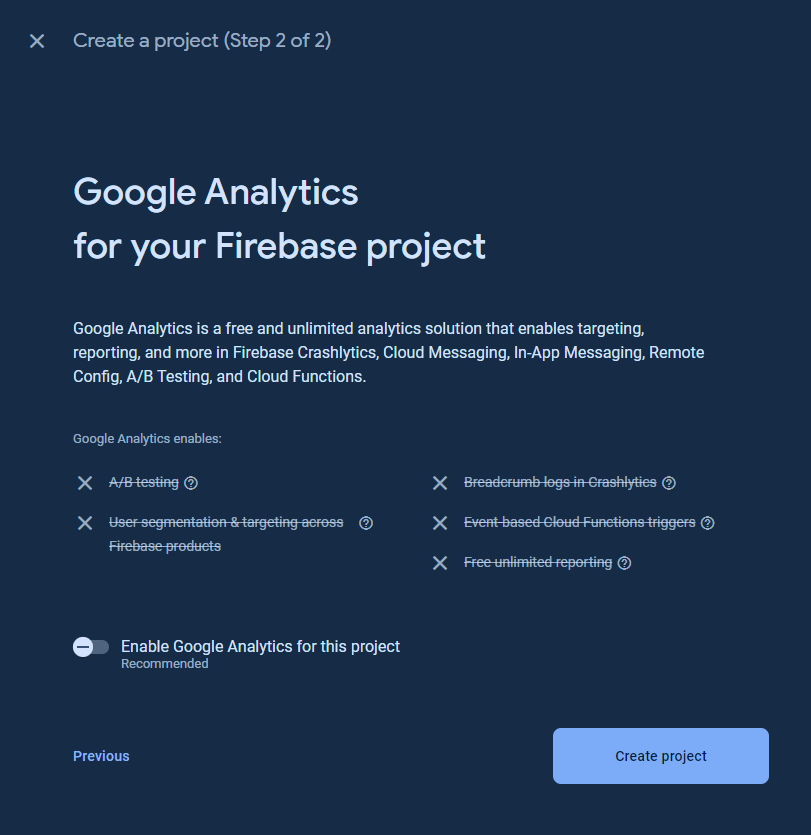
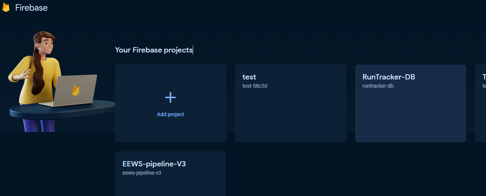
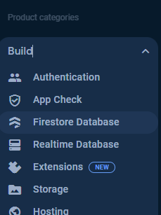
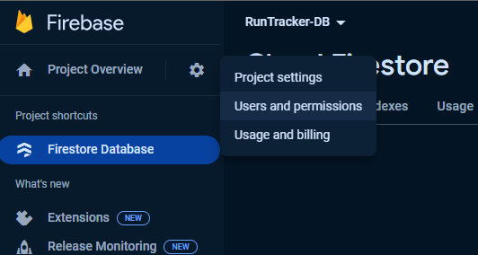
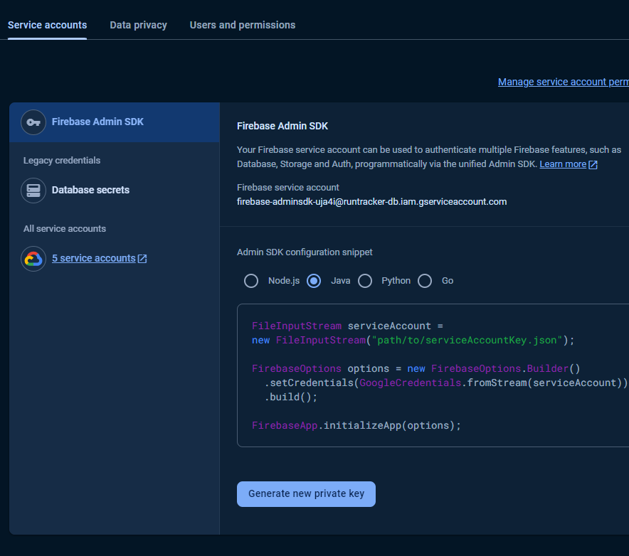
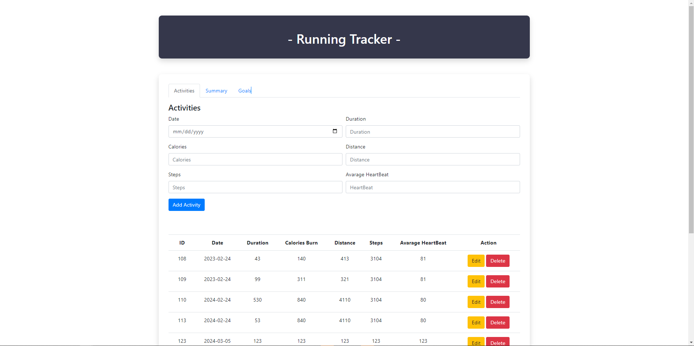

# RunTracker
By : Benhard Simanullang

## About Application
Embark on a personalized running journey with RunTracker, your all-in-one application for logging and enhancing your running activities. This app empowers you to effortlessly record your runs, and set ambitious goals over time.

RunTracker is constructed with the Ratpack library for the back-end, featuring multiple endpoints that users can leverage for their individual development ([for more details, click here](#api-documentation)). Utilizing Firebase for the database, users are required to set up their own accounts for database usage. To facilitate swift deployment, the application also provides a straightforward user interface, allowing users to promptly utilize it upon execution.

### Key Features of RunTracker:

#### Simple Activity Management:
Easily add, edit, or delete your daily running sessions with RunTracker, making it straightforward to maintain your exercise log.

#### Clear Activity History:
View a straightforward history of all your running activities, providing a quick overview of your progress and achievements.

#### Insightful Activity Summary:
Get a summarized view of your running efforts, including calories burned, steps taken, and total duration, for a quick understanding of your overall performance.

#### Easy Goal Setup:
Set achievable running goals within RunTracker to tailor your fitness journey according to your preferences and capabilities.

#### Efficient Goal Tracking:
Track your running goals efficiently in real-time, helping you stay motivated and aware of your progress without unnecessary complexity.


## How to start
### Pre-requisite
- Make Sure you have Graddle and JDK Installed in your device
- This Application is using Firebase as the database, make sure you have your account setup
  go to the console and create your project : https://firebase.google.com/docs/database/
### Running the application
#### Make your database and download your serviceAccountKey.json from your firebase console
1. go to your firebase console
2. create your project 
<p align="center">
  
</p>
<p align="center">
  
</p>

3. select your project

<p align="center">
   
</p>

4. go to build, choose firestore database

<p align="center">
  
</p>

5. click create database
6. select region and click next 
7. choose start in test mode, and create
8. go to user and permission

<p align="center">
  
</p>

9. go to service account
10. click the Generate new private key

<p align="center">
  
</p>

11. Make sure you save the .json file for later use

#### seting up the RunTracker application
1. clone the github repository

```
git clone https://github.com/BenhardSim/RunTracker.git
```
2. change directory
```
cd RunTracker
```  
3. Make sure you have the .json private key that generated from the firebase console
4. Make sure you rename it into serviceAccountKey.json
5. go to the specified location, create a directory called 'key' and file with name 'serviceAccountKey.json'.
```
mkdir src/main/java/org/example/firebaseConfig/key
touch src/main/java/org/example/firebaseConfig/key/serviceAccountKey.json
```
6. copy and paste the key you got from your firebase console to the serviceAccountKey.json that you just created.
7. after that execute the command bellow to build and run the application
```
gradle wrapper
./gradlew build
./gradlew run
```
8. when you see the application running on Localhost:5050 you can access the app via browser by typing it to access the simple user interface Utilizing the REST API endpoint.

<p align="center">
  
</p>

## [API Documentation](#api-documentation)

This documentation outlines the available endpoint within the application, designed for integration with the user's own user interface.

### Fetching data
#### RETRIEVING ALL ACTIVITY

```
GET /allactivity
```
response example
```
[
    {
        "date": "2023-02-24",
        "duration": 43,
        "activityId": 10312,
        "distance": 413,
        "avgHeartBeat": 81,
        "calories": 140,
        "steps": 3104
    },
    {
        "date": "2023-02-24",
        "duration": 99,
        "activityId": 13662,
        "distance": 321,
        "avgHeartBeat": 81,
        "calories": 311,
        "steps": 3104
    }
]
```
**Description :**
Retrieve all activities user has created before

<BR>

#### RETRIEVING ALL GOALS
```
GET /allgoals
```
response example
```
[
    {
        "goalId": 107,
        "totalCal": 400,
        "deadLine": "2023-02-24",
        "desc": "goals akhir tahun, harusss bisaa !!!",
        "status": "Finish"
    },
    {
        "goalId": 108,
        "totalCal": 100,
        "deadLine": "2024-07-05",
        "desc": "goals akhir tahun cuy !!!",
        "status": "Finish"
    }
]
```
**Description :**
Retrieve all activities user has created before

<BR>

#### RETRIEVING SUMMARY
```
GET /summary
```
response example
```
{
    "totalDuration": 4141,
    "totalStep": 13551,
    "AvgHBeat": 1243,
    "totalCalories": 3757,
    "totalDistance": 10410
}
```
**Description :**
Retrieve the summary of all the activities that user has created before

<BR>

#### RETRIEVING ACTIVITY DATA BASED ON ID

```
GET /activity/{activityId}
```
response example
```
{
    "date": "2024-02-24",
    "duration": 530,
    "activityId": 110,
    "distance": 4110,
    "avgHeartBeat": 80,
    "calories": 840,
    "steps": 3104
}
```
**Description :**
Retrieve an activity created by user based on the id 
```
GET /goal/{goalId}
```
response example
```
{
    "date": "2024-02-24",
    "duration": 530,
    "activityId": 110,
    "distance": 4110,
    "avgHeartBeat": 80,
    "calories": 840,
    "steps": 3104
}
```
**Description :**
Retrieve a goal created by user based on the id 

### Adding data
#### ADDING ACTIVITY DATA

```
POST /addactivity
Content-Type: application/json
```
content example :
```
{
    "activityId": 113,
    "date": "2024-02-24",
    "duration": 53,
    "calories": 220,
    "distance": 4110,
    "steps": 3104,
    "avgHeartBeat": 80
}
```
response example
```
{
    "Message": "Activity added successfully",
    "status": "Success"
}
```
**Description :**
Adding activity data into database with a structure and datatype as follows
<br>
- activityId : Integer
- date : String
- duration : Integer
- calories : Integer
- distance : Integer
- steps : Integer
- avgHeartBeat : Integer

<BR>

#### ADDING GOAL DATA
```
POST /addgoal
Content-Type: application/json
```
content example :
```
{
    "goalId": 121,
    "deadLine": "2025-03-05",
    "totalCal": 1220,
    "desc": "goals awal tahun"
}
```
response example
```
{
    "Message": "Goal added successfully",
    "status": "Success"
}
```
**Description :**
Adding goal data into database with a structure and datatype as follows
<br>
- goalId : Integer
- deadLine : String
- totalCal : Integer
- desc : String

### Editing data
#### EDITING ACTIVITY DATA
```
PUT /updateactivity/{activityId}
Content-Type: application/json
```
content example :
```
{
    "date": "2024-02-24",
    "duration": 53,
    "calories": 220,
    "distance": 4110,
    "steps": 3104,
    "avgHeartBeat": 80
}
```
response example
```
{
    "Message": "Activity updated successfully",
    "status": "Success"
}
```
**Description :**
Editing activity data into database with a structure and datatype as follows
<br>
- data : String
- duration : Integer
- calories : Integer
- distance : Integer
- steps : Integer
- avgHeartBeat : Integer

<BR><BR>
#### EDITING GOAL DATA
```
PUT /updategoal/{goalId}
Content-Type: application/json
```
content example :
```
{
    "deadLine": "2025-03-05",
    "totalCal": 1220,
    "desc": "goals awal tahun"
}
```
response example
```
{
    "Message": "Goal updated successfully",
    "status": "Success"
}
```
**Description :**
Editing activity data into database with a structure and datatype as follows
<br>
- deadLine : String
- totalCal : Integer
- desc : String

### Deleting data
#### DELETING ACTIVITY DATA
```
DELETE /deleteactivity/{activityId}
Content-Type: application/json
```
  response example
```
{
    "Message": "Activity deleted successfully",
    "status": "Success"
}
```
**Description :** deleting activity data based on activity Id
<br><br>
#### DELETING GOAL DATA
```
DELETE /deletegoal/{goalId}
Content-Type: application/json
```
response example
```
{
    "Message": "Goal deleted successfully",
    "status": "Success"
}
```
**Description :** deleting goal data based on goal Id


### Error Handling

**Bad Request : 400**

reponse example
```
{
    "message": "Invalid data format or type + {err} "
}
```
**Description :**
Wrong data type or empty field in Json request body

**Bad Request : 404**

reponse example
```
{
    "message": "No such document with ID: 11012 "
}
```
**Description :**
No data can be found in the database 

**Bad Request : 500**

reponse example
```
{
    "message": "Failed to add activity: + {errMsg}"
}
```
**Description :**
something is wrong in the logic of back-end or something wrong when reading, creating, deleting, or updating data in the database


    


